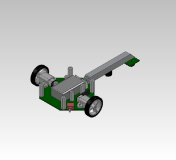
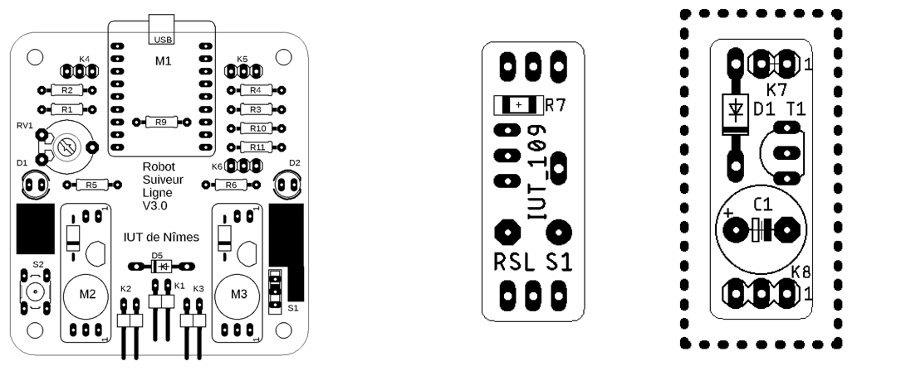

##  Robot Suiveur de Ligne  
**Objectif :** Concevoir un robot autonome suivant une ligne tracée au sol  

Présentation rapide de la solution : Le robot utilise des capteurs pour détecter une ligne et ajuste sa trajectoire en fonction des données reçues.

(Cette sae va plus tot etre acces sur la specialiter esi)

### 🔧 Compétences mobilisées :  
- 🔹 Conception du PCB sur **KiCad**  
- 🔹 Câblage et soudure des composants  
- 🔹 Programmation du microcontrôleur en **C** 
(MPLAB X)   
- 🔹 Test et validation du fonctionnement  

[👉 Voir mes projets personnel](projet_realiser.md){ .md-button }

### 1) Conception du PCB sur **KiCad**   
[👉 Lien vers Kikad](phttps://www.kicad.org/){ .md-button}
C'est a partir d'un plan de conception etudier avant au prealable(relaisation Du cahier des charges, Des calculs necessaires [👉lien vers les calculs pour plus de detail ](cahier.md){ .md-button} ) Nous avons realiser alors un plan de conception a partir d'un dossier de fabricatio :

 

 Objectif : Schématiser précisément le circuit afin de comprendre comment chaque composant est relié au reste du système, et s'assurer que toutes les connexions sont correctement effectuées. Nous avons pris en compte les dimensions réelles des composants pour que la disposition soit aussi fidèle que possible à ce que nous monterons physiquement plus tard. 
 