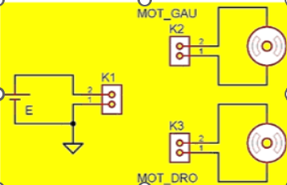
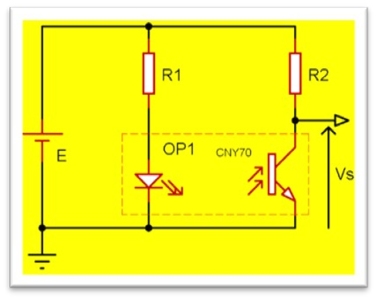
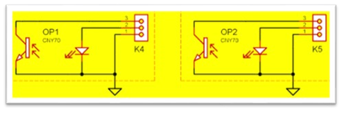

# 🧠 SAE S1 – Robot Suiveur de Ligne : Partie CONCEVOIR

## 🎯 Objectif de cette page

Cette page présente toutes les étapes de **conception** réalisées durant le projet SAE HC-LineBoT : de l’analyse fonctionnelle jusqu’à la fabrication du prototype. Elle met en valeur la **compétence C1** du référentiel BUT GEII.

---

## 📆 Heures tutorées

*Cette image montre la répartition des 6 séances de la SAE. J’ai appris à structurer un projet dans le temps, ce qui m’a aidé à mieux gérer les priorités : conception, tests, programmation, etc.*

---

## 📌 Analyse fonctionnelle et cahier des charges

*Voici une photo du châssis nu de notre robot. À ce stade, j’ai appris à identifier les différentes fonctions essentielles du système à partir de ses éléments mécaniques : propulsion, détection, traitement.*

📊 Fonctionnalités du robot

| Fonction | Description                         | Critère de performance       |
|----------|-------------------------------------|------------------------------|
| FP1      | Se déplacer sur un trajet noir      | Vitesse min. 10 cm/s         |
| FP2      | Détecter la ligne noire             | Capteur IR, distance < 1 cm  |
| FP3      | Réagir aux capteurs, contrôler LEDS | Temps de réaction < 200 ms   |

🎓 **Compétence C1a :** Analyse fonctionnelle  
📚 **Matières mobilisées :** Physique appliquée, Automatisme, PPP ,Elen

---

## ⚙️ Étude technique & choix des composants

## ⚙️ Étude technique & choix des composants

| 🔧 Moteur DC – Analyse et sélection |  |
|------------------------------------|----------------------------------------------|
| J’ai extrait les caractéristiques du moteur DC utilisé (6V, 300 tr/min, 157 mN·m). Grâce à la lecture de la datasheet, j’ai appris à choisir un composant adapté en fonction du couple requis. | |

---

| 🧩 Fonction FP1 – Mouvement |  |
|----------------------------|---------------------------------------------------|
| Ce schéma représente la fonction principale FP1 – mouvement.  J’ai appris à :<ul><li>Associer **le moteur** et **les roues**</li><li>Justifier le **choix du couple moteur**</li><li>Dimensionner les **résistances nécessaires**</li></ul> | |

---

| 📍 Fonction FP2 – Détection de ligne |  |
|-------------------------------------|----------------------------------------------------|
| Le capteur infrarouge détecte le contraste entre le noir et le blanc.  J’ai compris :<ul><li>Le **fonctionnement d’un capteur à réflexion**</li><li>Son **branchement en pont diviseur de tension**</li></ul> | |

---

### 🎓 Synthèse pédagogique

**Compétence :** `C1b – Choix technique raisonné`  
**Matières mobilisées :** Mathématiques, Physique, Électronique, Anglais technique

🎓 **Compétence C1b :** Choix technique raisonné  
📚 **Matières mobilisées :** Mathématiques, Physique, Électronique, Anglais technique

---

## Realisation d'un protype 
serie de calcul de resitance effectuer 

du coup on a fait une serie de calcul avnt de pouvoir cabler le prototype 

  
📊 Détail des Calculs (cliquer pour voir)

  

    <!-- Colonne gauche -->
    

      <h3>🔹 Calcul du courant I pour générer le couple maximum</h3>
      
I = C / k = 157 × 10⁻³ / 0,436 ≈ <strong>0,36 A</strong>

      <h3>🔹 Vitesse d'avance à 3,7 V</h3>
      
V3,7V = 300 × (3,7 / 6) = <strong>185 tr/min</strong>

      <h3>🔹 Calcul de la résistance R pour la LED</h3>
      
R = (3,7 - 1,7) / 0,005 = <strong>400 Ω</strong>

      
Valeur choisie : <strong>470 Ω</strong>

    

    <!-- Colonne droite -->
    

      <h3>🔹 Calcul de R1 et R3</h3>
      
R1 = (3,7 - 1,1) / (20 × 10⁻³) = <strong>130 Ω</strong>

      <h3>🔹 Calcul de R2 et R4</h3>
      
R2 = (3,7 - 0,1) / Ic, avec Ic = 20 mA

      
Valeurs approximatives : <strong>8 kΩ et 90 kΩ</strong>

      <h3>🔹 Calcul de R7 et R8</h3>
      
R7 = R8 = (3,7 - 0,6) / 0,005 = <strong>620 Ω</strong>

      
Valeur choisie : <strong>680 Ω</strong>

    

  

mise en place d'un pont diviseur de tension et cablage et test sur la labtech 

competence :  realiser un prototype 
lien avec les matiere : electronique tp 

## 🖥️ Conception électronique avec KiCad

### 📸 Schéma de test

|  Modele          | Schema de test      |
|----------------------|----------------------|
|                          |                                          |

*Ce premier schéma réalisé sur KiCad m’a permis de tester une version simplifiée du circuit pour valider l’implantation de base.*

### 📸 Version routée

*Le routage a été effectué en double face. J’ai appris à placer les composants en tenant compte de la logique du circuit et de la place disponible.*

### 📸 Schéma final

*Voici la version finale du schéma électronique. J’ai pris soin de bien connecter chaque composant et de corriger toutes les erreurs DRC/ERC signalées par le logiciel.*

### 📸 Vue 3D

*Grâce à la vue 3D, j’ai pu vérifier visuellement l’organisation des composants sur la carte. Cela m’a aidé à éviter les collisions physiques.*

🎓 **Compétence C1b :** Traduction schéma ↔ carte physique  
📚 **Matières mobilisées :** Électronique, CAO, Mathématiques

---

## 🔧 Fabrication de la carte

### 📸 Outils de soudure

*J’ai utilisé un fer à souder, une pompe à dessouder et des pinces de précision. J’ai appris à réaliser des soudures propres, solides et sans court-circuit.*

### 📸 Plan d’implantation

*Le plan m’a aidé à positionner correctement chaque composant sur la carte. Cela m’a permis d’éviter les erreurs de polarité et de valeur.*

### 📸 Carte finale soudée

*Photo de ma carte finale. Ce moment a été important pour moi : c’est la première fois que je réalisais un circuit complet, et le voir fonctionner m’a vraiment motivé.*

🎓 **Compétence C1c :** Réalisation matérielle conforme  
📚 **Matières mobilisées :** Électronique, Physique appliquée

---

## 💻 Programmation

Avec MPLAB X et la bibliothèque RSL_lib, nous avons codé le comportement du robot :

  <!-- Colonne gauche : Liste -->
  

    <h3>🧾 Étapes clés</h3>
    <ul>
      <li>Attente via bouton poussoir</li>
      <li>Réactions aux capteurs</li>
      <li>Contrôle moteur</li>
      <li>LEDs indicatives</li>
      <li>Tour complet (bonus)</li>
    </ul>
  

  <!-- Colonne droite : Code -->
  

    <h3>🧠 Logique du programme :</h3>
    <pre><code>
void main() {
    init_capteurs();
    while (!bouton_poussoir()) {
        // Attente
    }
    while (1) {
        lire_capteurs();
        controler_moteurs();
        afficher_etat_leds();
    }
}
    </code></pre>
  

### 🔄 Fonctions principales :

- `lire_capteurs()` → récupère données IR
- `controler_moteurs()` → ajuste PWM moteurs
- `afficher_etat_leds()` → debug LED

  
🔍 Afficher le code du robot (avec explications)

  <pre><code class="language-c">
// Attente d'un appui sur le bouton poussoir
while (BP_GetValue() != 0) {
    // Attente passive
}

// Pause de 5 secondes après le clic
__delay_ms(5000);

// Démarrage initial lent
avance_robot(160);

// Boucle principale
while (1) {

    // Si capteur droit = blanc (0), gauche = noir (1) → tourner à gauche
    if (lire_capteur_droit() == 0 && lire_capteur_gauche() == 1) {
        tourne_gauche_robot(100);   // Tourne à gauche
        allume_LED_V();             // LED verte = direction gauche
        eteindre_LED_R();           // Éteint LED rouge
    }

    // Si capteur droit = noir (1), gauche = blanc (0) → tourner à droite
    if (lire_capteur_droit() == 1 && lire_capteur_gauche() == 0) {
        tourne_droite_robot(100);   // Tourne à droite
        eteindre_LED_V();           // Éteint LED verte
        allume_LED_R();             // LED rouge = direction droite
    }

    // Si les deux capteurs = blanc (0) → avancer
    if (lire_capteur_droit() == 0 && lire_capteur_gauche() == 0) {
        avance_robot(230);          // Avance droit rapidement
        allume_LED_R();             // Allume LED rouge
        allume_LED_V();             // Allume LED verte
    }

    // Si capteur latéral détecte une fin de course
    if (lire_capteur_lateral() == 1) {
        break;                      // Sort de la boucle
    }
}

// Fin de parcours
avance_robot(0);                    // Arrêt complet
__delay_ms(1000);                   // Petite pause

// Rotation finale
tourne_droite_robot(180);
__delay_ms(3600);                   // Attente pour terminer la rotation
  </code></pre>

📷 Capture du code :

🎓 **Compétence C1b :** Réalisation d’un prototype logiciel  
📚 **Matières mobilisées :** Informatique embarquée, Automatisme

---

## ✅ Résumé de la partie CONCEVOIR

| Étape                | Compétence C1 | Matières                         |
|----------------------|---------------|----------------------------------|
| Analyse fonctionnelle| C1a           | Physique, Automatisme            |
| Calculs & composants | C1b           | Math, Physique, Anglais technique |
| CAO avec KiCad       | C1b           | Électronique, Info               |
| Fabrication PCB      | C1c           | Électronique, Énergie            |
| Programmation        | C1b           | Info, Automatisme                |
