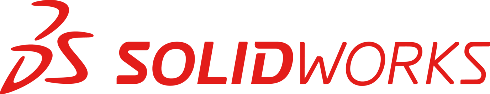

# 🎓 Portfolio - Abdelhalim Zouggagh   

Bienvenue sur mon portfolio !  
Vous y découvrirez mon parcours, mes compétences et mes projets réalisés en **Génie Électrique et Informatique Industrielle (GEII)**.  
 

## 🏅 À Propos de Moi  

🎓 <strong>Abdelhalim Zouggagh</strong>  
📍 <em>Étudiant en Génie Électrique et Informatique Industrielle (GEII) - IUT de Nîmes</em>  

<h2>📍 Localisation de mon IUT</h2>

<!-- Ajout de Leaflet.js -->
<link rel="stylesheet" href="https://unpkg.com/leaflet@1.9.4/dist/leaflet.css" />

🔹 **Parcours scolaire** :  
- 🎓 **Baccalauréat Général** (*Mathématiques & SES*)  
- 🏗️ **GEII - IUT de Nîmes** (*Projets en électronique, programmation, systèmes embarqués...*)  

🔹 **Compétences principales** :  
✅ Programmation (Python, C, HTML/CSS, Arduino)  
✅ Systèmes embarqués & électronique  
✅ Automatisme & réseaux industriels  

🔹 **Objectifs professionnels** :  
- 📡 Travailler dans le domaine des **systèmes embarqués et de l'électronique industrielle**  
- 🤖 Développer des solutions **d'automatisation et d’intelligence artificielle embarquée**  
- 🚀 Continuer mes études en **ingénierie ou recherche appliquée**  

<button id="dark-mode-toggle">🌙 Mode Sombre</button>

  <h2>Mes Compétences</h2>

  

    <label for="html">Code C</label>
    <progress id="html" value="90" max="100"></progress>
  

  

    <label for="css">Ladder</label>
    <progress id="css" value="85" max="100"></progress>
  

  

    <label for="js">Arduino</label>
    <progress id="js" value="75" max="100"></progress>
  

  

    <label for="python">Python</label>
    <progress id="python" value="80" max="100"></progress>
  

## 🛠️ Logiciels Utilisés

| MPLAB X | Control Expert | WinRelais | Machine Expert |
|---------|----------------|-----------|----------------|
|  |  |  |  |

| SolidWorks | KiCad | TIA Portal | Arduino IDE |
|------------|-------|------------|--------------|
|  |  |  | 

