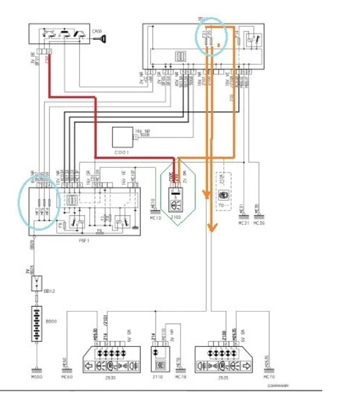

# 🔧 Compétences acquises en parallèle des études

## 🌟 Objectif de cette page

Cette page présente des **compétences techniques** que j'ai développées **en dehors du cadre strict de ma formation GEII**, mais qui complètent directement les **apprentissages et compétences acquises** dans les SAE (notamment **Concevoir** et **Vérifier**), ainsi que dans des modules comme **Automatisme**, **Électronique**, **Informatique embarquée** et **Physique appliquée**.

## 🛱️ Diagnostic approfondi sur smartphone en panne

Au fil du temps, j'ai commencé à faire des **réparations de téléphones** en autonomie. Ce n’était plus juste des changements d’écran ou de batterie, mais des **diagnostics électroniques plus poussés**.

### 🔎 Exemple concret : redémarrage automatique après chute

Un téléphone redémarrait toutes les 2 minutes après une chute. J'ai suivi une démarche structurée :

- J'ai analysé les **logs système** pour chercher des erreurs
- J'ai constaté une **anomalie au niveau du micro d'ambiance**, situé sur la nappe du flash
- En ouvrant l’appareil, j’ai observé que **la nappe était endommagée** et provoquait un court-circuit
- Cette nappe étant reliée à la carte mère, cela provoquait un **comportement instable** par sécurité

| Nappe Flash                             | Fichier source                         |
|-----------------------------------------|----------------------------------------|
|  |          |

J'ai alors **isolé le composant**, Remplacer la nappe, et le téléphone a **cessé de redémarrer**.

### 🧠 Compétences mobilisées :

- Lire et comprendre des **logs techniques** (informatique)
- Interpréter des symptômes pour **identifier une panne matérielle**
- Faire le lien entre **matériel et logiciel**, comme dans un système embarqué

## 🔦 Réparation d'écran de télévision (auto-formation)

Dans une démarche personnelle, j'ai réussi à **réparer un écran plat de télévision** qui présentait un affichage noir.

### 🧩 Étapes réalisées :

- Démontage du panneau arrière avec précaution (repérage des nappes et connecteurs)
- Test de la carte T-Con et **vérification des tensions de sortie** avec un multimètre
- Analyse visuelle des composants CMS (condensateurs éventrés, traces de chaleur)
- Remplacement d’un **fusible CMS** près du connecteur de nappe LVDS
- Réassemblage et test complet

🎓 *Cette intervention m'a permis de mieux comprendre le fonctionnement des interfaces LVDS et d'affichage, en lien direct avec mes cours d'électronique.*

## 🚗 Projet personnel – Diagnostic d'une panne électrique automobile

### ❌ Problème rencontré

Sur ma Peugeot 206, les **feux stop ne s’allumaient plus**. J’avais bien du 12V après le Neiman, mais aucune tension aux bornes des fusibles dédiés aux feux stop. Aucun voyant d’erreur clair au tableau de bord. Il s’agissait donc de localiser et diagnostiquer la panne **sans valise OBD**, uniquement avec des outils simples.

---

### 🔎 Démarche technique suivie

1. **Lecture du schéma électrique** (recherche sur forums & documentation technique)
2. **Contrôle des tensions** avec lampe témoin et multimètre sur :
   - Fusibles F11 et F12
   - Contacteur de pédale de frein
   - Relais
3. **Test du contacteur de frein** en le shuntant avec un trombone (cf. schéma 2 ci-dessous)
4. **Interprétation des mesures** (tension, continuité, court-circuit)
5. **Détection d’un relais collé**, probablement à cause d’une surtension
6. **Remplacement du relais** ➜ feux redevenus pleinement fonctionnels

---

### 🖼️ Schémas utilisés et interprétés

#### Schéma 1 – Vue globale du circuit stop avec alimentation, fusible, relais et retour masse

#### Schéma 2 – Tests terrain réalisés avec lampe témoin et contacteur de frein

> 📌 Ces schémas m’ont aidé à **visualiser la position du défaut** : entre Neiman et platine de fusibles. J’ai aussi appris à **tester un contacteur** et identifier une rupture de circuit en aval d’un relais.

---

### 🎯 Compétences mobilisées

- Lecture et interprétation de **schémas électriques complexes**
- Utilisation d’un **multimètre, lampe témoin**, tests de continuité et de tension
- Diagnostic **logique et structuré** d’une panne réelle
- Connaissances appliquées en **automatismes, électrotechnique et câblage**

---

### 🧠 Liens pédagogiques avec la formation GEII

| Activité personnelle         | Compétence GEII | Matières associées                      | SAE liée       |
|-----------------------------|-----------------|-----------------------------------------|----------------|
| Diagnostic panne électrique | C2              | TP Électrotechnique, Lecture de schémas | SAE S1, S3.2   |

> 💬 *Cette expérience m’a permis d’appliquer concrètement des savoirs vus en cours, notamment lors des SAE sur les stations de pompage ou les alimentations électriques.*

---

### 🔁 Retour d’expérience

J’ai compris l’importance :
- D’utiliser **la bonne méthode de test** (lampe témoin > multimètre pour des mesures fiables)
- De faire **des mesures par comparaison** (tension attendue vs mesurée)
- D’anticiper l’impact de **faux contacts ou relais collés**
- D’avoir une **lecture critique d’un schéma**, même non issu d’un cours

## 🚀 En quoi ces activités m’ont fait progresser ?

Ces expériences personnelles ont renforcé ma capacité à :

- Comprendre les **systèmes complexes** en les analysant par blocs (comme en analyse fonctionnelle)
- Appliquer mes **compétences pratiques** dans des contextes réels
- Réagir face à des **pannes techniques** et trouver des **solutions concrètes**
- Me rendre compte de la **cohérence entre les cours** et le **monde réel**

🎯 *Ces activités \"de loisir\" sont devenues peu à peu des **interventions professionnelles**. Cela m’a conforté dans mon choix de formation et m’a motivé à continuer à apprendre par la pratique.*
