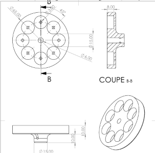

## 🎨 Concevoir

### 🛠️ Utilisation de SolidWorks pour la conception du moteur de drone

Dans le cadre du projet **SAE Moteur de Drone**, j'ai utilisé SolidWorks pour concevoir le rotor et le stator du moteur à partir d'un plan de conception. Cette étape a été cruciale pour l'assemblage des composants du moteur et pour garantir que les pièces s'adaptent correctement pour accueillir les aimants. Voici ce que j'ai appris et réalisé pendant cette phase de conception :

- **Création de cotes et modélisation 3D :** J'ai appris à définir des cotes précises pour chaque composant du moteur, en assurant que toutes les pièces s'assemblent parfaitement.
- **Conception du rotor et du stator :** À partir du plan de conception initial, j'ai modélisé les composants en 3D et optimisé la conception pour la fabrication.
- **Assemblage des composants :** J'ai réalisé l'assemblage virtuel des pièces du moteur afin de vérifier leur bon fonctionnement dans le projet global.

 [Modèle 3D du moteur dans SolidWorks](lien_vers_document_solidworks)

